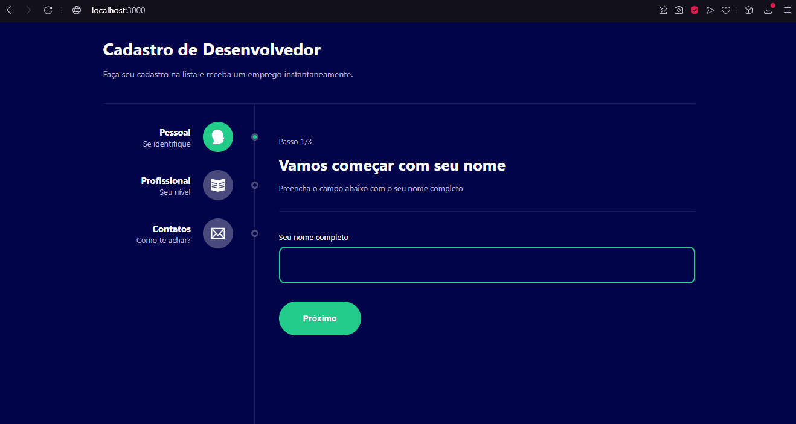

<h1>App de Cadastro Desenvolvedores</h1>

<h4>Projeto em desenvolvimento...</h4>

<h2>Sobre</h2>

<p>Aplicativo para cadastro de "emprego" para desenvolvedores, começamos com seu nome, depois </br>
selecione seu nível como programador, logo após indique seu email e github, e no último passo </br>
verá seus dados na tela!
</p>

### Features
- [x] Insira seu nome
- [x] Nos diga seu nível como programador
- [x] Onde podemos te encontrar
- [] Veja as informações na tela!

<h1>
    
</h1>

### Pré-requisitos
Antes de começar, você vai precisar das seguintes ferramentas: [Git](https://git-scm.com), [Node.js](https://nodejs.org/en/) e um editor de código, como o [VSCode](https://code.visualstudio.com/)

### Rodando o projeto
```bash
# Clone este repositório
git clone https://github.com/MalcolmMello/cadastroApp

# Acesse a pasta do projeto pelo seu terminal
cd cadastroApp

# Instale as dependências
npm install

# Inicie a aplicação
npm start

# O servidor irá rodar na porta:300 - acesse <http://localhost:3000>

```

### Tecnologias
- React
- Typescript
- Styled-components
- Router
- Reducer

---

Feito no desafio 5 projetos em 5 dias pela B7Web - [Meu LinkedIn](https://www.linkedin.com/in/malcolm-de-mello-a8208a224/)